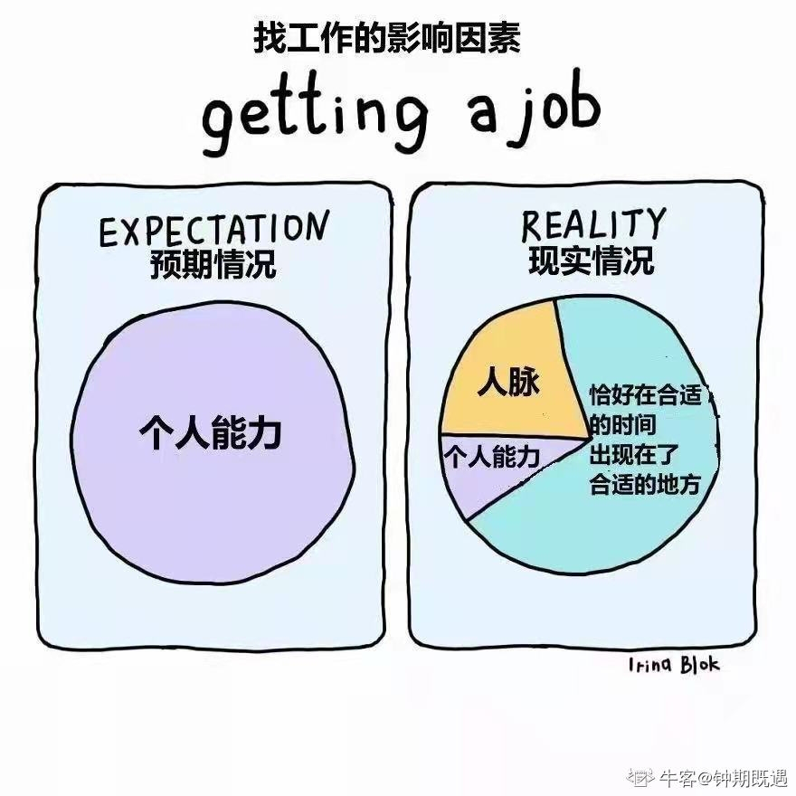

# 互联网实习分享

### 个人情况介绍：

绩点平平，常年人奖二等。无实验室经历，无大创经历，美赛只有参与奖，开源项目只有老师不介意公布的课设，短暂参与过南小宝的开发，后因为顶不住课业退出。到找实习前，我LeetCode刷了大概120+；少数经典题做了两三遍。21年的寒假，我给自己定下了大学阶段找到两段实习，最好是一个国内大厂一个国外大厂的“大跃进”目标。当时觉得异想天开的目标如今却成为了我简历上扎扎实实的经历，目前为止，我有一段四个月在字节TikTok iOS开发的实习经历，一段三个月在微软CMD做后端开发的实习经历。希望我的经历能对你有所帮助。

### 实习类型和投递策略

实习一般分为日常实习和暑期实习两种，以下对比来自我个人体验和学长学姐的经验，仅供参考：

我当时是希望在大三（22年）寒假和暑假能各找一段实习，所以寒假投递的是日常，暑假投递的是暑期实习。寒假的时间线可以参考我的博客，简单来说是12月初拿到offer，1月入职，预计3月底离职，实习三个月时间。因为当时所在的组比较缺人，所以我投递的岗位是带有转正机会的，并且对方也不介意我实习3个月。根据我学长的经验（仅供参考），即便jd建议实习6个月，也可以先投递尝试，因为实习生是可以任意时间提出离职而没有其他法律后果的，所以可以干到不想干了就跑路。

21年12月，我在微信公众号上看到谷歌开始了暑期实习招聘，微软开始了提前批。尽管当时驾照科二+期末复习忙的我晕头转向，我也还是在跨年夜当前晚上改好了简历投递。因为想要中奖就必须先买彩票，看到机会就得要争取。并且微软的提前批免了笔试，还不影响正式批投递，多一次机会，何乐不为？事实证明我是正确的，因为我在字节实习初期不忙的时候就完成了微软的面试并且顺利的在过年前拿到offer，年后开学+字节实习新手期结束的情况下，再准备面试会变得非常手忙脚乱。这两家外企的面经可以参考[我的博客](https://august0830.github.io/post/155d23b4/)。

投递策略上，一般客户端的难度会低于后端，并且如果实在缺人，会欢迎0基础的同学，我第一份实习就是在0基础的情况下投递的。做了一段时间发现我可能还是更想做后端的方向，于是在找暑期的时候就尽可能的争取了后端的方向。客户端的实习在我看来成为了我的跳板，毕竟第一份实习总是最难的，有了经验以后会顺利很多。同理，第一份实习也可以从中小厂开始，一步步积累履历。另外，尽可能的往自己偏好的方向靠，比如我希望去外企工作并接触英文工作环境，所以当时在同时看到西瓜直播内推的情况下，选择了TikTok。

投递实习包括找工作这件事本质可以用这张图来概括

所以，尽可能多的收集信息让自己在合适的的时间出现在合适的地点非常关键。我的第一份实习是在论坛上找到的组内直推，内推我的人和我介绍了组里的情况，活人内推就可以找到一些成功率很大的岗位，并且也可以提前了解一些情况。去了以后实习体验还是很不错的。平常多刷刷论坛也可以感知到风向，比如哪些企业经营状况稳定，更可能招实习生；哪些企业实习hc本身就少，成功率低等等。另外也可以找学长学姐帮忙内推：）抓住内推和提前批的机会，就是在利用信息差快人一步～

### 软硬件准备

#### **算法题**

* 什么时间刷题？

还在上课的情况下，关键是抓紧课余时间刷题，比如我大三上早上三四节没有课，就早八之后回宿舍刷题，或者晚上睡前刷一道。晚上比较累就刷看起来简单的题或者复习之前的题，早上精神状态好就刷medium或者hard题。总之尽可能抽时间每天接触算法相关的内容。

* 刷什么题？

新手刷题推荐有题解讲解的题，并且面向面试最好刷高频题。我刷的是LeetCode的热题100，听说剑指offer的题也不错。网上应该有很多类似的总结，重点是坚持刷下去。

如果有意面外企，推荐NeetCode，题目都在美区LeetCode，题解和讲解视频也都是英语，而且切入和讲解非常通俗易懂，选取的题目也非常经典，适合快速上手。从读题到分析到讲解思路全方位的用英语来锻炼自己可以帮助对英语技术内容脱敏，还可以熟悉一些算法术语。

（说到英语如果有机会可以再写一篇我是如何适应在实习中使用英语工作并且在秋招技术面试中被外企面试官称赞口语excellent的）

* 怎么刷题？
  * 不会做别慌！
    * 刚开始不会做很正常，不用太自责，我也是这样过来的：）可以从brute force开始，再学习他人是如何优化的。如果一道题分析了5min以上还是没有思路就尽快看答案，没必要死磕，因为时间有限。但是认为自己看懂其他人的solution之后要争取自己能过复现。光知道思路是不够的，能够在有思路的情况下写出bug free的代码是需要下苦工夫的。
  * 写题解
    * 面试中光撕出算法题是不够的，还需要你能够短时间内给面试官解释清楚你是如何想出这个解法的。即便你的解法不是最优解，即便你看了别人的解法，也有记录下来的必要。输出是检验输入的最佳方式，如果你能够简明扼要地解释清楚如何解，为何如此解，说明你的确掌握了这道题。并且记录下来也有助于之后回头复习，或者是进行多种解法的对比。
    * 进阶版：如果有志向去外企，或者锻炼英语，可以挑战用英语写题解。能极大程度锻炼你的口语和写作。如何解释一道算法题可以参考NeetCode讲解题目的方式。很多时候用一个具体的例子，即便你的口语稀碎也能解释明白。可以录下来播放给自己听，至少自己要能听懂自己在说什么。
  * Spaced Repetition-间隔重复 少量多次
    * 对不会做的、没有优化出最优解的、认为有代表性的算法题，标记并定期安排复习，第二遍第三遍做的时候争取自己能独立写出来并且完成优化。
  * 按专题还是随机？
    * 我高中的时候理综老师们达成的一致是：对理综要先专题突破再综合练习。我认为在刷算法题上也是一样。最开始需要在经典题集里按照专题来刷，帮助自己横向对比并且摸索出同一类型的通用解法。熟练之后就应该锻炼拿到随机一道算法题能分析出用什么数据结构或者算法的能力。
    * 不过面试前可以针对性的搜一下该企业高频算法题。
    * ps：强推黄宇老师的算法课，动态规划、树，递归，DFS，BFS，回溯法等内容讲的很透彻，上过黄宇老师的课再配合LeetCode会有一种恍然大悟的感觉。

#### **简历**

* 简历写什么
  * 关于如何写简历，用什么工具写，网上都有很多教程，就不赘述了。我自己是按照STAR原则（Situation Task Action Result）来写的，用的工具是超级简历。根据我自己和身边人的经验，最难的其实是不知道简历上写什么。除了基本的信息之外，对于毫无经历的本科生来说，接下来的内容如何填满是大问题。
  * 首先，在技能上可以写你学过的计算机课程，比如操作系统，计算机网络，数据库，算法和数据结构等。这能让HR知道你具备基础的计算机知识。
  * 其次，项目上写上课设就可以了。不需要觉得课设很水不好意思写。毕竟除了课设就没东西了（大佬请忽略本条吐槽）。水不水其实取决于你的下一步准备。如果你对自己的课设非常有信心，非常好，请在老师允许的情况下把代码开源，并且记得在简历中附上链接。
  * 如果想要开始找实习，建议好好装扮一下自己的GitHub、LinkedIn等主页并且在简历上附上链接。如果有自己的博客当然更好，记得也要附上。说不定面试官会看。这是非常好的展示自己的机会。
  * 简历写好以后可以请学长学姐帮忙检查优化一下。光自己觉得写得好是不够的，得让其他人也能通过简历看到你的亮点与优势。
  * 如果想要投递外企，还需要准备一份英文简历，可以多上LinkedIn学习他人的简历写法。小心语法问题。 可以参照CMU等国外名校的简历写作指导： [CMU](https://www.cmu.edu/career/resource-library/resumes-and-cover-letters/index.htm), [UCLA](https://career.ucla.edu/alumni/resumes-and-cover-letters), [Columbia University](https://www.careereducation.columbia.edu/resources/sample-resumes)
* 如何基于简历准备面试
  * 课设在有工作经验的人眼里可能都差不多，所以不需要太担心，反正大家都一样菜（大佬请同样忽略），而且作为没有实习经历的学生，对方的要求不会太高。所以关键是通过问答展现出你的潜质和目前具有的代码能力。
  * 对于自己的课设，不妨问问自己以下问题：
    * 这个课设项目是做什么的，解决了什么问题，或者做出了一个怎样的程序？它有什么功能？
    * 你的项目代码由哪些部分构成？每个部分的功能是什么？各部分是如何联系在一起的？
    * 你是如何设计这个项目的代码框架的？有什么别出心裁或者你认为需要注意的地方？（进阶版）采用了什么设计思想？
    * 如果这个项目是从零开始的，你是如何从头开始设计的？如何切入的？你如何保证代码的可扩展性和可读性？
    * 如果这个项目用了其他框架，使用了什么框架以及其中的哪些机制？这些框架机制的原理是什么？是如何实现的？
    * 你认为在做这个项目的过程中，最困难的一步是什么？遇到的最难的技术问题是什么？你是如何解决的？
    * 如果你的项目包括了团队协作，你是如何与你的队友协作的？团队合作中遇到过哪些问题？
    * 你认为你的项目还有什么需要改进的地方？是否考虑过错误处理/掉线等等意外情况？如何保证你的项目的健壮性？
    * 如果你能很自信的回答上述的问题，那么说明你对自己的课设其实非常了解。事实上，很多课设都有值得深挖的地方，有可能我们平常并没有仔细深入，所以才会觉得不太有价值。如果发现自己不太能讲明白，请多翻翻你的代码还有实验报告～
  * 如果有意投递外企，请尝试用英文回答上述问题～ 在这个过程中又可以了解英文术语并锻炼口语啦。

#### **计算机基础知识（俗称八股）**

没学过的课程八股不背也没关系，反正背了也是一问就露馅的。但是选课尽可能涵盖你目标岗位的技能要求，具体可以参考目标岗位的jd。

如果是像我一样长教训才会记住知识点的，可以通过面试来学习。面多了就会发现某些高频题经常出现。当然，能够通过网上的高频题面经来学习是最好的。（插入我用过的一些高频题面经）

除了通用的高频题，还需要针对自己简历上的项目准备一些基础知识。面试官看可能会顺着项目问到。

#### **关于面试**

面试也是一件需要练习的事情。面多了就有经验了。当然能找学长学姐模拟面试是最好的。在拿到第一份实习之前，我在大二下投递过字节飞书后端和腾讯的后端实习，字节二面挂，腾讯一面挂。尽管没有如愿拿到大二暑期实习，但是也给我积累了宝贵的经验，无论是技术上的还是心态上的。我第一次认识到，原来挂了除了难过两天，并没有任何损失。

我自己的体验是：

* 做算法题的时候一定要和面试官多沟通，哪怕没有什么思路也要讲自己当前的思路，让面试官看到你在思考，也许ta会给你提示，或者你讲着讲着就有思路了。另外的好处是避免沉默的尴尬（啊这
* 面外企最好准备英文自我介绍，以及behavior question。

### 一些杂七杂八

#### 行政问题与课程冲突？

* 首先，如果有实习的计划，尽可能把学分早点休完，保证出去实习的那个学期课不要太多。同时和辅导员及时沟通，因为要搞实习申请，课太多/不及时和老师沟通都会有影响。

#### 我独自生活？

* 如果是线下实习，还是很考验照顾自己的能力的。关于租房，尽可能避开中介，找房东直租，过程中可以多多咨询父母，注意看合同！！（血泪教训）

#### 实习能带来什么？留心观察这些——

* 实习除了积累履历，赚点零花之外，还有一个很重要的功能是拓宽体验，为之后的决策提供支持。你是否适应工作的节奏和思维模式？这家企业/这个小组的工作风格是否适合你？你喜欢国内大厂还是外企？这些问题都可以在实习体验中得到回答。
* 为了最大化的获取信息，可以从以下角度来观察自己的实习体验：工作内容；工作氛围；团队协作的方式；技术基础设施建设；与你对接的部门都在干什么。

### 一点鸡汤：

南大本科已经足够让你度过很多简历关，但是能否拿到offer，实习中表现如何，取决于你自己。牌子既有用，也没用。

能不能找到实习和工作，是否能找到大厂的实习和工作，其实和你的水平不完全是正相关，毕竟hc情况，与面试官是否合得来都可能是影响因素。刚开始被挂太正常了，面试不通过有时和你自身的水平没有关系，关键是识别出是否有能够改正的地方并且提升自己。

想要中奖就要多买彩票，事实上在投递这件事上，你没有任何非常了不起的损失。上课划水的时候投投简历，又不像留学申请一样需要交申请费。遇到机会就要冲上去抓住。

过程很煎熬，但是坚持下去才有可能看到希望，并且日后一定会感谢咬牙坚持的自己。当我在实习周末快乐的在外面玩耍的时候，我就非常感谢一年前坚持刷题投简历的自己。
